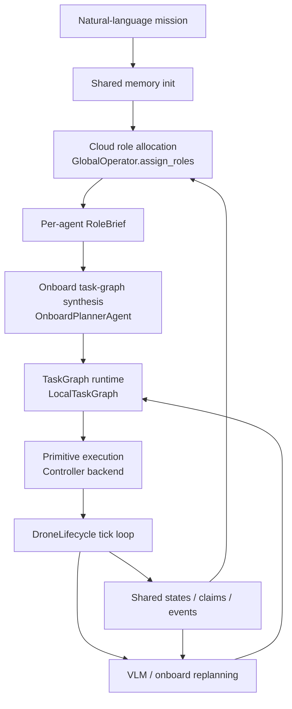
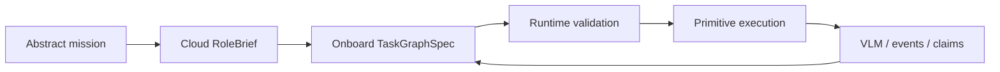
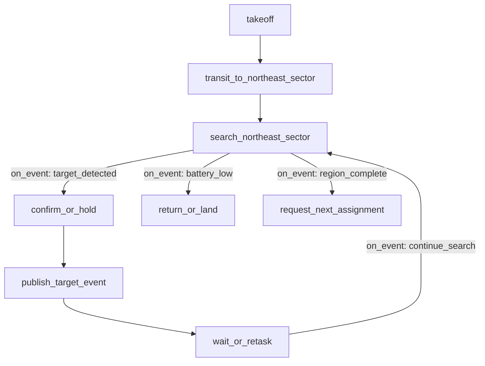
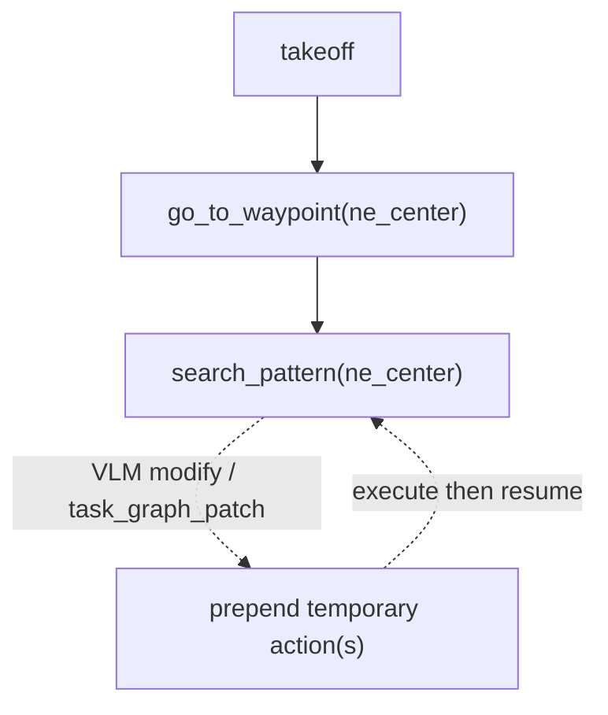
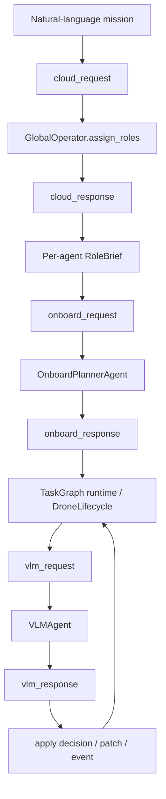

# LLM2Swarm

一个面向多智能体协同的云边协同框架原型。

这个仓库提供一套面向多智能体协同的统一接口：

- 用户给出抽象任务，例如 `search the area for fire`
- 云端只做角色分配，不直接给完整动作序列
- 机载 planner 根据 `RoleBrief + 当前上下文 + 当前能力` 生成初始任务图
- 执行中再由 VLM / 本地模型根据图像、共享记忆、事件来修改任务图
- runtime 负责验证、执行、共享状态、协调 claim / event

这套框架目前接入了无人机 demo，但接口按“通用多智能体”设计，后续可以接更强模型、agent framework、不同 agent 类型，甚至地面机器人。

## 项目定位

这个项目由“群体智能运行框架 + Webots / mock 验证平台”两部分组成，重点在：

- 抽象任务输入
- 云端角色分工
- 机载任务图生成
- 共享记忆与事件流
- primitive registry / capability registry
- runtime 校验与执行

而不是某一个具体场景的写死策略。

火情搜索目前只是一个 `test sample`，不是框架的唯一目标。

## 总体流程



如果只看“任务如何从抽象意图变成可执行流程”，可以把这套框架理解成：



可以把它理解成 5 层：

1. `Mission layer`
用户给出粗粒度任务，不直接规定动作。

2. `Cloud role layer`
云端根据 mission、初始状态、agent profile 产出 `RoleBrief`。

3. `Onboard planning layer`
机载 planner 把 `RoleBrief` 转成 `TaskGraphSpec`。

4. `Runtime layer`
任务图 runtime、memory pool、claim / event、能力校验。

5. `Execution layer`
具体 primitive 和控制器实现，例如 `mock` / `Webots`。

## 任务图执行模型

下面用一个具体例子说明：

- 用户任务：`search the area for fire`
- 云端把 `drone_1` 分到“东北角区域”
- 机载 planner 需要为 `drone_1` 生成初始任务图

### 任务图语义示例

机载 planner 生成的任务图可以同时包含主路径和事件驱动分支。



这类图的关键不是 `takeoff -> goto -> search` 本身，而是：

- `target_detected` 时能跳到确认节点
- `false_alarm / continue_search` 时能回到搜索节点
- `battery_low` 时能走退出分支
- `region_complete` 时能申请下一个任务

### Runtime 执行方式

仓库里的 `TaskGraphSpec` 接口已经支持 `nodes + edges + conditions`，runtime 会把它映射到可执行 primitive 流程。

现在更接近下面这种执行方式：



执行语义可以概括为：

- 初始图通常是一个比较短的 backbone
- runtime 主要稳定支持 `on_success`
- 图会先被线性化成 primitive queue
- 动态变化目前主要靠 `VLMDecision.new_action` 或 `TaskGraphPatch`
- 持续性行为更多由 `search_pattern` 这类 continuous primitive 承担

### 已实现能力与扩展方向

这套 runtime 已经具备：

- `TaskGraphSpec` / `TaskGraphPatch` 作为统一接口
- 机载模型生成图
- runtime 校验图是否合法
- VLM 在运行时插入 patch

仍待继续增强的部分包括：

- 真正的图状态机执行
- 基于 `on_event` / `on_failure` 的原生图跳转
- 图上的回边和分支条件求值
- “当前节点指针 + 事件驱动迁移”的通用 graph engine

从执行模型上看，它更接近：

- `图接口 + 线性执行 + 运行时补丁`

而不是：

- `完整事件驱动图执行器`

## 核心数据契约

这些结构定义在 [models/schemas.py](/Users/hyb/LocalProj/LLM2Swarm/models/schemas.py)。

### 1. `RoleBrief`

云端给单个 agent 的职责说明。

它现在是通用结构，不绑定“搜索任务”，重点描述：

- `mission_role`
- `mission_intent`
- `responsibilities`
- `constraints`
- `coordination_contracts`
- `capability_requirements`
- `capability_exclusions`
- `resource_requirements`
- `resource_permissions`
- `success_criteria`
- `handoff_conditions`
- `event_watchlist`
- `shared_context`
- `initial_hints`
- `metadata`

它**不应该**直接等于 action list。

### 2. `AgentProfile`

agent 的能力画像。

它描述的是：

- `agent_id`
- `agent_kind`
- `available_primitives`
- `available_capabilities`
- `available_resources`
- `hard_constraints`
- `metadata`

这层是后续支持“无人机 + 地面机器人 + 载荷 agent”的关键接口。

### 3. `TaskGraphSpec`

机载 planner 生成的初始任务图。

它描述的是：

- `graph_id`
- `summary`
- `nodes`
- `edges`
- `entry_node_id`
- `required_capabilities`
- `required_resources`
- `metadata`

其中 `TaskGraphNode` 可以带：

- `action`
- `required_capabilities`
- `required_resources`

所以任务图不仅有动作，还有能力约束。

### 4. `TaskGraphPatch`

运行时对任务图做的增量 patch。

目前主要支持：

- `prepend_nodes`
- `prepend_edges`
- `reason`
- `metadata`

### 5. `VLMDecision`

机载视觉 / 本地模型每个 tick 返回：

```json
{ "decision": "continue" }
```

或者：

```json
{
  "decision": "modify",
  "new_task": "inspect anomaly",
  "new_action": {
    "action": "hover",
    "params": { "duration": 2.0 }
  },
  "task_graph_patch": {
    "reason": "insert short inspection step",
    "prepend_nodes": [],
    "prepend_edges": []
  },
  "event": {
    "type": "target_detected",
    "source": "vlm",
    "priority": 2,
    "payload": {}
  },
  "memory_update": "possible anomaly observed"
}
```

## 关键可修改组件

这一节是后续改模型、改 agent、改 primitive 时最重要的接口说明。

### 1. 云端角色规划器

文件：

- [operators/global_operator.py](/Users/hyb/LocalProj/LLM2Swarm/operators/global_operator.py)

核心接口：

```python
await GlobalOperator.assign_roles(
    mission_description: str,
    initial_states: dict[str, DroneState | dict] | None = None,
    agent_profiles: dict[str, AgentProfile | dict] | None = None,
) -> GlobalRolePlan
```

职责：

- 接收抽象 mission
- 接收初始状态
- 接收各 agent 的能力画像
- 输出每个 agent 的 `RoleBrief`

后续可改进方向：

- 换更强的 LLM
- 换 agent framework
- 强化 role allocation prompt
- 接入地图、地形、外部数据库

**重要约束**：
只要输出仍然是 `GlobalRolePlan`，下游基本不用改。

### 2. 机载初始任务图生成器

文件：

- [operators/onboard_planner.py](/Users/hyb/LocalProj/LLM2Swarm/operators/onboard_planner.py)

核心接口：

```python
await OnboardPlannerAgent.build_initial_task_graph(
    context: OnboardPlanningContext
) -> OnboardPlanningResponse
```

输入包含：

- `RoleBrief`
- `AgentProfile`
- `self_state`
- `peer_states`
- `active_claims`
- `active_events`
- `available_primitives`
- `available_capabilities`

输出是：

- `TaskGraphSpec`
- `planner_notes`
- `memory_update`

后续可改进方向：

- 从单次模型调用升级为多步 agent planner
- 引入外部工具、地图工具、检索工具
- 生成更丰富的 `TaskGraphSpec`
- 从“只返回 primitive 节点”升级为更复杂的 graph 节点

**重要约束**：
只要仍然输出 `OnboardPlanningResponse`，runtime 不需要跟着重写。

### 3. 机载 VLM / 运行时重规划器

文件：

- [operators/vlm_agent.py](/Users/hyb/LocalProj/LLM2Swarm/operators/vlm_agent.py)

核心接口：

```python
await VLMAgent.decide(
    drone_id: str,
    position: tuple[float, float, float],
    velocity: tuple[float, float, float],
    status: str,
    current_task: str | None,
    image_b64: str,
    peer_states: dict[str, DroneState],
    claims: list[TaskClaim] | None = None,
    events: list[TaskEvent] | None = None,
    available_primitives: list[PrimitiveSpec] | None = None,
    available_capabilities: list[str] | None = None,
) -> VLMDecision
```

职责：

- 每个 tick 看图像和上下文
- 决定 `continue` 或 `modify`
- 可附带 `event`
- 可附带 `task_graph_patch`

后续可改进方向：

- 换更强 VLM
- 换 agentic VLM
- 引入多步观察与工具调用
- 更稳定地产出结构化 patch / event

**重要约束**：
只要仍然返回 `VLMDecision`，`DroneLifecycle` 不需要改。

### 4. 任务图 runtime

文件：

- [operators/local_planner.py](/Users/hyb/LocalProj/LLM2Swarm/operators/local_planner.py)

核心入口：

```python
build_task_graph_runtime(
    drone_id: str,
    role_brief: RoleBrief,
    graph_spec: TaskGraphSpec,
    agent_profile: AgentProfile | None = None,
) -> LocalTaskGraph
```

职责：

- 线性化当前任务图
- 应用 `task_graph_patch`
- 接受 `VLMModify`
- 记录事件
- 校验图是否满足当前 agent 能力约束

当前限制：

- runtime 还主要走“线性 primitive 执行”
- 对 `TaskGraphEdge` 的支持仍偏轻量
- 更复杂的 `decision / wait_event / claim / terminal` 节点语义后续还可继续增强

### 5. Primitive registry / capability registry

文件：

- [primitives/registry.py](/Users/hyb/LocalProj/LLM2Swarm/primitives/registry.py)

这是现在最关键的扩展点之一。

它统一管理：

- primitive 名称
- handler 名称
- 参数 schema
- capability tags
- resource tags
- continuous 语义

核心函数：

```python
list_registered_primitives()
get_primitive_spec(name)
register_primitive(spec)
build_agent_profile(...)
```

后续如果你提升模型能力，这层不用动；但如果你新增 agent 动作，这层通常要动。

### 6. 控制器后端

文件：

- [controllers/base_controller.py](/Users/hyb/LocalProj/LLM2Swarm/controllers/base_controller.py)
- [controllers/mock_controller.py](/Users/hyb/LocalProj/LLM2Swarm/controllers/mock_controller.py)
- [controllers/webots_controller.py](/Users/hyb/LocalProj/LLM2Swarm/controllers/webots_controller.py)

controller 负责：

- 连接 simulator / backend
- 读位置、速度、相机
- 执行 primitive
- 暴露自己的 `AgentProfile`

`execute_action()` 通过 registry 读取 primitive 定义并分发到具体 handler。

## 更新模型能力时，需要遵守什么接口

这是后续替换模型后端或接入 agent framework 时最重要的部分。

### 1. 升级云端角色规划模型

保持不变的接口：

- 输入：`mission + initial_states + agent_profiles`
- 输出：`GlobalRolePlan`

你可以换：

- 更强 LLM
- planner agent
- 外部工具链

但只要保留 `assign_roles()` 这个 contract，下游不需要重构。

### 2. 升级机载 planner

保持不变的接口：

- 输入：`OnboardPlanningContext`
- 输出：`OnboardPlanningResponse`

你可以换：

- 更强本地模型
- 多步 agent
- 带检索/地图工具的 agent planner

只要输出仍是 `TaskGraphSpec`，runtime 还是能承接。

### 3. 升级 VLM / 运行时本地智能

保持不变的接口：

- 输入：当前观测 + 当前共享上下文 + 当前能力约束
- 输出：`VLMDecision`

你可以让模型更聪明，但不建议改掉这个数据契约。

## 添加新的无人机动作，应该改哪里

这是最常用的扩展路径。

### 标准步骤

1. 在 [primitives/registry.py](/Users/hyb/LocalProj/LLM2Swarm/primitives/registry.py) 注册新的 `PrimitiveSpec`

这里定义：

- primitive 名称
- handler 名称
- 参数
- capability tags
- resource tags
- 是否 continuous

2. 在相应 controller backend 里实现 handler

例如：

- [controllers/mock_controller.py](/Users/hyb/LocalProj/LLM2Swarm/controllers/mock_controller.py)
- [controllers/webots_controller.py](/Users/hyb/LocalProj/LLM2Swarm/controllers/webots_controller.py)

如果只有某一类 agent 支持这个动作，只在对应 backend / subclass 实现即可。

3. 如果这个动作代表新的能力或资源，确保 `PrimitiveSpec` 的 `capability_tags / resource_tags` 写对

这样 `AgentProfile`、云端角色分配、机载 planner、VLM prompt 都会自动看到这项能力。

4. 补测试

至少建议补：

- controller 执行测试
- registry surface test
- runtime 接受/拒绝能力约束测试

## 运行模式

仓库支持三种运行形态：

- `mock`
- `Webots` 单机 demo
- `Webots` 多机 demo

### 1. Mock

```bash
conda activate llm2swarm
python main.py
```

### 2. 单机 Webots demo

```bash
./scripts/start_tunnel.sh
./scripts/run_webots_single_demo.sh
```

单机路径已经打通：

- `camera -> VLM -> action`
- `RoleBrief -> OnboardPlanner -> TaskGraph`

### 3. 多机 Webots demo

```bash
./scripts/start_tunnel.sh
./scripts/run_webots_swarm_demo.sh
```

这条路径会先运行：

- [scripts/prepare_webots_swarm_plan.py](/Users/hyb/LocalProj/LLM2Swarm/scripts/prepare_webots_swarm_plan.py)

它会：

- 初始化 SQLite 共享 memory
- 收集 `initial_states`
- 收集 `agent_profiles`
- 调云端 `assign_roles()`
- 写入 per-agent `RoleBrief`

然后 Webots 中每个 controller 进程再各自：

- 读取自己的 `RoleBrief`
- 调 `OnboardPlannerAgent`
- 得到初始 `TaskGraph`
- 启动 `DroneLifecycle`

## Debug Mode

仓库支持一个“人工门控”的 debug mode。

打开后，系统会在关键模型传输节点暂停，把 request / response 落到磁盘里，等待你人工决定：

- `continue`
- `regenerate`
- `abort`

这个模式是**文件门控**，不是 stdin 交互，所以：

- 云端初始化阶段可以用
- 单机 Webots 可以用
- 多机 Webots 的多进程 controller 也可以用

这正是它比“在子线程里直接等 input()”更稳的地方。

### Debug Mode 插在整条链路里的位置



这张图里每个 `*_request / *_response` 都可以被 debug gate 暂停。

默认只打开前四个：

- `cloud_request`
- `cloud_response`
- `onboard_request`
- `onboard_response`

这样最适合检查：

- mission 是否真的传给了 cloud planner
- `RoleBrief` 是否合理
- onboard request 是否真的吃到了 `RoleBrief + self_state + peer_states + agent_profile`
- onboard response 是否生成了合法 `TaskGraph`

### 支持的关键阶段

- `cloud_request`
- `cloud_response`
- `onboard_request`
- `onboard_response`
- `vlm_request`
- `vlm_response`

默认只打开前四个，也就是：

- 云端角色分配前后
- 机载初始任务图生成前后

这样比较适合先调前半段。

如果你把 `vlm_request / vlm_response` 也打开了，默认行为是：

- 每架无人机只在第一次 VLM request 暂停一次
- 每架无人机只在第一次 VLM response 暂停一次

也就是说，运行时不会因为每个 tick 都停下来而不可用。

这个默认行为可以通过环境变量控制：

```bash
export LLM2SWARM_DEBUG_VLM_PAUSE_ONCE=1
```

默认就是开启状态。

### 如何打开

最简单的方式：

```bash
export LLM2SWARM_DEBUG=1
./scripts/run_webots_swarm_demo.sh
```

或者单机：

```bash
export LLM2SWARM_DEBUG=1
./scripts/run_webots_single_demo.sh
```

默认 debug stages 是：

```bash
cloud_request,cloud_response,onboard_request,onboard_response
```

如果你连运行时 VLM 也想停下来一起看，可以显式打开：

```bash
export LLM2SWARM_DEBUG_STAGES=cloud_request,cloud_response,onboard_request,onboard_response,vlm_request,vlm_response
```

`run_webots_single_demo.sh` 和 `run_webots_swarm_demo.sh` 在 debug mode 下会自动启动本地 debug UI，
并在终端打印：

- `panel url`
- `panel log`

在 macOS 上，默认还会自动帮你打开浏览器。

默认地址是：

```text
http://127.0.0.1:8765
```

如果这个端口已经被占用，debug UI 会自动切换到下一个可用端口，并在终端打印实际 URL。

如果你想改 host / port：

```bash
export LLM2SWARM_DEBUG_UI_HOST=127.0.0.1
export LLM2SWARM_DEBUG_UI_PORT=8765
```

如果你不想自动打开浏览器：

```bash
export LLM2SWARM_DEBUG_UI_OPEN_BROWSER=0
```

如果你不想自动启动面板：

```bash
export LLM2SWARM_DEBUG_UI_AUTO_START=0
```

### 程序暂停后去哪里看

默认目录：

```bash
/tmp/llm2swarm_debug
```

每次运行会写一个 session 目录，里面每个暂停点都会生成一个 step 目录，包含：

- `payload.json`
- `meta.json`
- `instructions.txt`
- `command.txt`（等待你写入命令）

### 如何查看和放行

先列出 pending 的暂停点：

```bash
conda run -n llm2swarm python scripts/debug_gate.py list
```

最方便的方式通常是直接看“最新那个”：

```bash
conda run -n llm2swarm python scripts/debug_gate.py show latest
```

然后对某个 step 回复命令：

```bash
conda run -n llm2swarm python scripts/debug_gate.py reply /tmp/llm2swarm_debug/<session>/<step> continue
```

也可以写：

- `regenerate`
- `abort`

如果你不想一直在终端里找路径，也可以开一个本地网页面板：

```bash
conda run -n llm2swarm python scripts/debug_gate.py serve
```

如果你已经知道 session，也可以只看这一轮：

```bash
conda run -n llm2swarm python scripts/debug_gate.py serve --session <session_id>
```

### 这个模式适合什么

比较适合：

- 检查云端 role allocation prompt/输出
- 检查机载 bootstrap task graph prompt/输出
- 在真实多机联调时做人工门控

不太适合默认长期打开运行时 VLM 全阶段，因为：

- 每个 tick 都可能暂停
- 多机时会产生很多 step 目录

所以更推荐：

- 前半段默认开
- 后半段按需打开

这里还有一层保护：

- 即使打开 `vlm_request / vlm_response`
- 默认也只暂停每架无人机的第一次 VLM tick

## Tunnel / Remote Ollama

仓库里的云端角色规划、机载 planner、VLM demo，默认都不是直接连公网 API，
而是通过本机 SSH tunnel 转发到远端 Ollama 服务。

也就是说，README 里这些地址：

- `http://localhost:11435/v1`

通常表示的是：

- `本机 11435` -> `SSH tunnel` -> `远端 Ollama server`

而不是“你本机自己启动了一个 Ollama”。

### 什么时候需要 tunnel

如果你要运行这些路径，就需要先确保 tunnel 是通的：

- `GlobalOperator.assign_roles()`
- `OnboardPlannerAgent.build_initial_task_graph()`
- `VLMAgent.decide()`
- `./scripts/run_webots_single_demo.sh`
- `./scripts/run_webots_swarm_demo.sh`
- `tests/test_phase3.py` 里的 live VLM 部分

如果 tunnel 没起：

- `curl http://localhost:11435/...` 会失败
- live 模型调用会超时或报 connection error
- Webots demo 会退回 fallback 或卡在在线模型步骤

### 启动方式

先检查状态：

```bash
./scripts/start_tunnel.sh --status
```

如果 tunnel 没有建立，再启动：

```bash
./scripts/start_tunnel.sh
```

### 如何确认 tunnel 已经打通

最直接的检查方法：

```bash
curl --noproxy localhost -s http://localhost:11435/api/tags
```

如果正常，你应该能看到类似：

- `qwen3.5:4b`
- `qwen3.5:9b`

也可以用脚本自带状态检查：

```bash
./scripts/start_tunnel.sh --status
```

### 和 `.env` 的关系

常见配置是：

```env
EDGE_VLM_BASE_URL=http://localhost:11435/v1
GLOBAL_LLM_BASE_URL=http://localhost:11435/v1
ONBOARD_PLANNER_BASE_URL=http://localhost:11435/v1
```

这些值只有在 tunnel 正常建立时才有意义。
当这些 `*_BASE_URL` 指向 `localhost` 或私网地址时，仓库里的
OpenAI-compatible 客户端现在会默认绕过系统 HTTP 代理环境变量，
避免在 Clash / 代理开启时出现 Python SDK 直接报 `Connection error`
但 `curl --noproxy localhost` 正常的情况。

如果后续你改成：

- 直接连远端可访问地址
- 直接连本机 Ollama
- 或切回 OpenAI / 其他 provider

那么 tunnel 这一步就可以相应调整或去掉。

## 环境变量

最常用的是：

```env
SIMULATOR_BACKEND=mock
LOG_LEVEL=INFO

EDGE_VLM_BASE_URL=http://localhost:11435/v1

GLOBAL_LLM_BASE_URL=http://localhost:11435/v1
GLOBAL_LLM_MODEL=qwen3.5:4b
GLOBAL_LLM_TIMEOUT=180
GLOBAL_LLM_MAX_RETRIES=3
GLOBAL_LLM_RETRY_BASE_DELAY=2

ONBOARD_PLANNER_BASE_URL=http://localhost:11435/v1
ONBOARD_PLANNER_MODEL=qwen3.5:4b
ONBOARD_PLANNER_TIMEOUT=90
```

Webots 多机初始化额外支持：

- `WEBOTS_SWARM_DRONES`
- `WEBOTS_SWARM_DB`
- `WEBOTS_SWARM_WORLD_FILE`
- `WEBOTS_SWARM_INITIAL_STATES`
- `WEBOTS_SWARM_AGENT_PROFILES`

其中：

- `WEBOTS_SWARM_INITIAL_STATES` 用于显式注入初始状态
- `WEBOTS_SWARM_AGENT_PROFILES` 用于显式注入 agent profile
- 如果没提供，demo 脚本会做合理 fallback

## 测试

运行：

```bash
conda activate llm2swarm
python tests/test_phase1.py
python tests/test_phase2.py
python tests/test_phase3.py
```

测试覆盖：

- `Phase 1`
  - controller 基础能力
  - registry surface
  - schema 基础解析

- `Phase 2`
  - memory / claim / event
  - `RoleBrief` 兼容映射
  - `AgentProfile` 基础推导
  - `GlobalOperator.assign_roles()` prompt contract
  - `OnboardPlannerAgent` prompt contract

- `Phase 3`
  - lifecycle
  - task graph runtime
  - VLM modify / event
  - claim / event 流
  - capability-aware runtime validation

这些测试更偏“框架 contract / runtime 回归”，不是对真实模型效果的最终评估。

## 已知限制

- Webots demo 目前仍然只实现了一小组 primitive
- `TaskGraph` runtime 还偏线性执行，不是完整的通用 graph engine
- demo fallback 里仍然有 `bootstrap_actions` 样例，这部分属于示例数据，不是框架核心
- Webots 端到端联调仍然需要人工观察 GUI

## TODO

后续改进项单独整理在：

- [TODO.md](/Users/hyb/LocalProj/LLM2Swarm/TODO.md)

## 一句话总结

这个仓库的核心是一套可扩展接口：

`抽象任务 -> 云端角色分配 -> 机载任务图生成 -> 运行时视觉/事件重规划 -> primitive 执行`

后续无论你换更强模型、换 agent framework、加新 agent 类型、加新 primitive，都可以沿着这套 contract 扩展。
