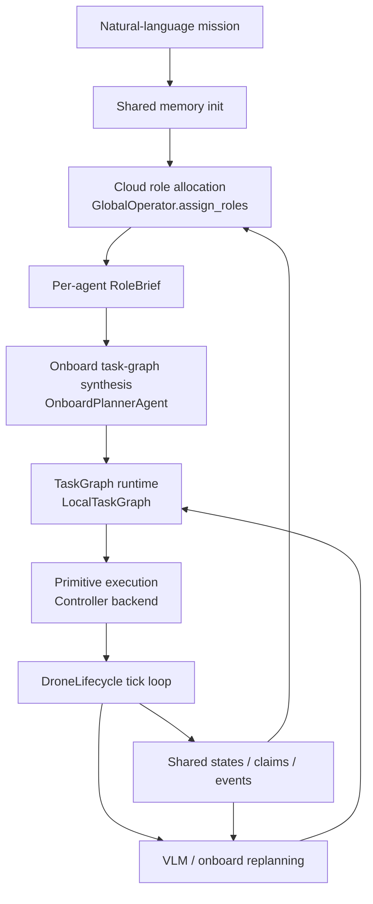

# LLM2Swarm

一个面向多智能体协同的云边协同框架原型。

这个仓库现在的目标，不再是“云端直接把每架无人机的动作列表规划到底”，而是提供一套更通用的接口：

- 用户给出抽象任务，例如 `search the area for fire`
- 云端只做角色分配，不直接给完整动作序列
- 机载 planner 根据 `RoleBrief + 当前上下文 + 当前能力` 生成初始任务图
- 执行中再由 VLM / 本地模型根据图像、共享记忆、事件来修改任务图
- runtime 负责验证、执行、共享状态、协调 claim / event

当前这套框架被用于无人机 demo，但接口是按“通用多智能体”去设计的，后续可以接更强模型、agent framework、不同 agent 类型，甚至地面机器人。

## 当前定位

这个项目当前更像“群体智能运行框架 + Webots / mock 验证平台”，重点在：

- 抽象任务输入
- 云端角色分工
- 机载任务图生成
- 共享记忆与事件流
- primitive registry / capability registry
- runtime 校验与执行

而不是某一个具体场景的写死策略。

火情搜索目前只是一个 `test sample`，不是框架的唯一目标。

## 总体流程



可以把它理解成 5 层：

1. `Mission layer`
用户给出粗粒度任务，不直接规定动作。

2. `Cloud role layer`
云端根据 mission、初始状态、agent profile 产出 `RoleBrief`。

3. `Onboard planning layer`
机载 planner 把 `RoleBrief` 转成 `TaskGraphSpec`。

4. `Runtime layer`
任务图 runtime、memory pool、claim / event、能力校验。

5. `Execution layer`
具体 primitive 和控制器实现，例如 `mock` / `Webots`。

## 核心数据契约

这些结构定义在 [models/schemas.py](/Users/hyb/LocalProj/LLM2Swarm/models/schemas.py)。

### 1. `RoleBrief`

云端给单个 agent 的职责说明。

它现在是通用结构，不绑定“搜索任务”，重点描述：

- `mission_role`
- `mission_intent`
- `responsibilities`
- `constraints`
- `coordination_contracts`
- `capability_requirements`
- `capability_exclusions`
- `resource_requirements`
- `resource_permissions`
- `success_criteria`
- `handoff_conditions`
- `event_watchlist`
- `shared_context`
- `initial_hints`
- `metadata`

它**不应该**直接等于 action list。

### 2. `AgentProfile`

当前 agent 的能力画像。

它描述的是：

- `agent_id`
- `agent_kind`
- `available_primitives`
- `available_capabilities`
- `available_resources`
- `hard_constraints`
- `metadata`

这层是后续支持“无人机 + 地面机器人 + 载荷 agent”的关键接口。

### 3. `TaskGraphSpec`

机载 planner 生成的初始任务图。

它描述的是：

- `graph_id`
- `summary`
- `nodes`
- `edges`
- `entry_node_id`
- `required_capabilities`
- `required_resources`
- `metadata`

其中 `TaskGraphNode` 可以带：

- `action`
- `required_capabilities`
- `required_resources`

所以任务图不仅有动作，还有能力约束。

### 4. `TaskGraphPatch`

运行时对任务图做的增量 patch。

目前主要支持：

- `prepend_nodes`
- `prepend_edges`
- `reason`
- `metadata`

### 5. `VLMDecision`

机载视觉 / 本地模型每个 tick 返回：

```json
{ "decision": "continue" }
```

或者：

```json
{
  "decision": "modify",
  "new_task": "inspect anomaly",
  "new_action": {
    "action": "hover",
    "params": { "duration": 2.0 }
  },
  "task_graph_patch": {
    "reason": "insert short inspection step",
    "prepend_nodes": [],
    "prepend_edges": []
  },
  "event": {
    "type": "target_detected",
    "source": "vlm",
    "priority": 2,
    "payload": {}
  },
  "memory_update": "possible anomaly observed"
}
```

## 关键可修改组件

这一节是后续改模型、改 agent、改 primitive 时最重要的接口说明。

### 1. 云端角色规划器

文件：

- [operators/global_operator.py](/Users/hyb/LocalProj/LLM2Swarm/operators/global_operator.py)

核心接口：

```python
await GlobalOperator.assign_roles(
    mission_description: str,
    initial_states: dict[str, DroneState | dict] | None = None,
    agent_profiles: dict[str, AgentProfile | dict] | None = None,
) -> GlobalRolePlan
```

职责：

- 接收抽象 mission
- 接收初始状态
- 接收各 agent 的能力画像
- 输出每个 agent 的 `RoleBrief`

后续可改进方向：

- 换更强的 LLM
- 换 agent framework
- 强化 role allocation prompt
- 接入地图、地形、外部数据库

**重要约束**：
只要输出仍然是 `GlobalRolePlan`，下游基本不用改。

### 2. 机载初始任务图生成器

文件：

- [operators/onboard_planner.py](/Users/hyb/LocalProj/LLM2Swarm/operators/onboard_planner.py)

核心接口：

```python
await OnboardPlannerAgent.build_initial_task_graph(
    context: OnboardPlanningContext
) -> OnboardPlanningResponse
```

输入包含：

- `RoleBrief`
- `AgentProfile`
- `self_state`
- `peer_states`
- `active_claims`
- `active_events`
- `available_primitives`
- `available_capabilities`

输出是：

- `TaskGraphSpec`
- `planner_notes`
- `memory_update`

后续可改进方向：

- 从单次模型调用升级为多步 agent planner
- 引入外部工具、地图工具、检索工具
- 生成更丰富的 `TaskGraphSpec`
- 从“只返回 primitive 节点”升级为更复杂的 graph 节点

**重要约束**：
只要仍然输出 `OnboardPlanningResponse`，runtime 不需要跟着重写。

### 3. 机载 VLM / 运行时重规划器

文件：

- [operators/vlm_agent.py](/Users/hyb/LocalProj/LLM2Swarm/operators/vlm_agent.py)

核心接口：

```python
await VLMAgent.decide(
    drone_id: str,
    position: tuple[float, float, float],
    velocity: tuple[float, float, float],
    status: str,
    current_task: str | None,
    image_b64: str,
    peer_states: dict[str, DroneState],
    claims: list[TaskClaim] | None = None,
    events: list[TaskEvent] | None = None,
    available_primitives: list[PrimitiveSpec] | None = None,
    available_capabilities: list[str] | None = None,
) -> VLMDecision
```

职责：

- 每个 tick 看图像和上下文
- 决定 `continue` 或 `modify`
- 可附带 `event`
- 可附带 `task_graph_patch`

后续可改进方向：

- 换更强 VLM
- 换 agentic VLM
- 引入多步观察与工具调用
- 更稳定地产出结构化 patch / event

**重要约束**：
只要仍然返回 `VLMDecision`，`DroneLifecycle` 不需要改。

### 4. 任务图 runtime

文件：

- [operators/local_planner.py](/Users/hyb/LocalProj/LLM2Swarm/operators/local_planner.py)

核心入口：

```python
build_task_graph_runtime(
    drone_id: str,
    role_brief: RoleBrief,
    graph_spec: TaskGraphSpec,
    agent_profile: AgentProfile | None = None,
) -> LocalTaskGraph
```

职责：

- 线性化当前任务图
- 应用 `task_graph_patch`
- 接受 `VLMModify`
- 记录事件
- 校验图是否满足当前 agent 能力约束

当前限制：

- runtime 还主要走“线性 primitive 执行”
- 对 `TaskGraphEdge` 的支持仍偏轻量
- 更复杂的 `decision / wait_event / claim / terminal` 节点语义后续还可继续增强

### 5. Primitive registry / capability registry

文件：

- [primitives/registry.py](/Users/hyb/LocalProj/LLM2Swarm/primitives/registry.py)

这是现在最关键的扩展点之一。

它统一管理：

- primitive 名称
- handler 名称
- 参数 schema
- capability tags
- resource tags
- continuous 语义

核心函数：

```python
list_registered_primitives()
get_primitive_spec(name)
register_primitive(spec)
build_agent_profile(...)
```

后续如果你提升模型能力，这层不用动；但如果你新增 agent 动作，这层通常要动。

### 6. 控制器后端

文件：

- [controllers/base_controller.py](/Users/hyb/LocalProj/LLM2Swarm/controllers/base_controller.py)
- [controllers/mock_controller.py](/Users/hyb/LocalProj/LLM2Swarm/controllers/mock_controller.py)
- [controllers/webots_controller.py](/Users/hyb/LocalProj/LLM2Swarm/controllers/webots_controller.py)

当前 controller 负责：

- 连接 simulator / backend
- 读位置、速度、相机
- 执行 primitive
- 暴露自己的 `AgentProfile`

现在 `execute_action()` 已经从 registry 读 primitive，而不是手写固定 dispatch。

## 更新模型能力时，需要遵守什么接口

这是后续把普通 `llm/vlm` 换成更强 agent framework 时最重要的部分。

### 1. 升级云端角色规划模型

保持不变的接口：

- 输入：`mission + initial_states + agent_profiles`
- 输出：`GlobalRolePlan`

你可以换：

- 更强 LLM
- planner agent
- 外部工具链

但只要保留 `assign_roles()` 这个 contract，下游不需要重构。

### 2. 升级机载 planner

保持不变的接口：

- 输入：`OnboardPlanningContext`
- 输出：`OnboardPlanningResponse`

你可以换：

- 更强本地模型
- 多步 agent
- 带检索/地图工具的 agent planner

只要输出仍是 `TaskGraphSpec`，runtime 还是能承接。

### 3. 升级 VLM / 运行时本地智能

保持不变的接口：

- 输入：当前观测 + 当前共享上下文 + 当前能力约束
- 输出：`VLMDecision`

你可以让模型更聪明，但不建议改掉这个数据契约。

## 添加新的无人机动作，应该改哪里

这是最常用的扩展路径。

### 标准步骤

1. 在 [primitives/registry.py](/Users/hyb/LocalProj/LLM2Swarm/primitives/registry.py) 注册新的 `PrimitiveSpec`

这里定义：

- primitive 名称
- handler 名称
- 参数
- capability tags
- resource tags
- 是否 continuous

2. 在相应 controller backend 里实现 handler

例如：

- [controllers/mock_controller.py](/Users/hyb/LocalProj/LLM2Swarm/controllers/mock_controller.py)
- [controllers/webots_controller.py](/Users/hyb/LocalProj/LLM2Swarm/controllers/webots_controller.py)

如果只有某一类 agent 支持这个动作，只在对应 backend / subclass 实现即可。

3. 如果这个动作代表新的能力或资源，确保 `PrimitiveSpec` 的 `capability_tags / resource_tags` 写对

这样 `AgentProfile`、云端角色分配、机载 planner、VLM prompt 都会自动看到这项能力。

4. 如果还在使用旧的 `plan_mission()` 兼容路径，再补 legacy schema

也就是：

- [models/schemas.py](/Users/hyb/LocalProj/LLM2Swarm/models/schemas.py) 里的老 `TaskAction`
- [operators/global_operator.py](/Users/hyb/LocalProj/LLM2Swarm/operators/global_operator.py) 里的旧 action-list prompt

但这条路径现在是兼容层，不是主路径。

5. 补测试

至少建议补：

- controller 执行测试
- registry surface test
- runtime 接受/拒绝能力约束测试

### 现在这套方式为什么比以前更好

因为现在新增动作时，不需要再同时手改：

- controller dispatch 表
- onboard planner 的 primitive 列表
- VLM prompt 的 primitive 列表

这些都已经改成从 registry 读取。

## 运行模式

当前仓库支持三种运行形态：

- `mock`
- `Webots` 单机 demo
- `Webots` 多机 demo

### 1. Mock

```bash
conda activate llm2swarm
python main.py
```

### 2. 单机 Webots demo

```bash
./scripts/start_tunnel.sh
./scripts/run_webots_single_demo.sh
```

当前单机路径已经打通：

- `camera -> VLM -> action`
- `RoleBrief -> OnboardPlanner -> TaskGraph`

### 3. 多机 Webots demo

```bash
./scripts/start_tunnel.sh
./scripts/run_webots_swarm_demo.sh
```

这条路径会先运行：

- [scripts/prepare_webots_swarm_plan.py](/Users/hyb/LocalProj/LLM2Swarm/scripts/prepare_webots_swarm_plan.py)

它会：

- 初始化 SQLite 共享 memory
- 收集 `initial_states`
- 收集 `agent_profiles`
- 调云端 `assign_roles()`
- 写入 per-agent `RoleBrief`

然后 Webots 中每个 controller 进程再各自：

- 读取自己的 `RoleBrief`
- 调 `OnboardPlannerAgent`
- 得到初始 `TaskGraph`
- 启动 `DroneLifecycle`

## 环境变量

最常用的是：

```env
SIMULATOR_BACKEND=mock
LOG_LEVEL=INFO

EDGE_VLM_BASE_URL=http://localhost:11435/v1

GLOBAL_LLM_BASE_URL=http://localhost:11435/v1
GLOBAL_LLM_MODEL=qwen3.5:4b

ONBOARD_PLANNER_BASE_URL=http://localhost:11435/v1
ONBOARD_PLANNER_MODEL=qwen3.5:4b
```

Webots 多机初始化额外支持：

- `WEBOTS_SWARM_DRONES`
- `WEBOTS_SWARM_DB`
- `WEBOTS_SWARM_WORLD_FILE`
- `WEBOTS_SWARM_INITIAL_STATES`
- `WEBOTS_SWARM_AGENT_PROFILES`

其中：

- `WEBOTS_SWARM_INITIAL_STATES` 用于显式注入初始状态
- `WEBOTS_SWARM_AGENT_PROFILES` 用于显式注入 agent profile
- 如果没提供，demo 脚本会做合理 fallback

## 测试

运行：

```bash
conda activate llm2swarm
python tests/test_phase1.py
python tests/test_phase2.py
python tests/test_phase3.py
```

当前测试覆盖：

- `Phase 1`
  - controller 基础能力
  - registry surface
  - schema 基础解析

- `Phase 2`
  - memory / claim / event
  - `RoleBrief` 兼容映射
  - `AgentProfile` 基础推导
  - `GlobalOperator.assign_roles()` prompt contract
  - `OnboardPlannerAgent` prompt contract

- `Phase 3`
  - lifecycle
  - task graph runtime
  - VLM modify / event
  - claim / event 流
  - capability-aware runtime validation

这些测试更偏“框架 contract / runtime 回归”，不是对真实模型效果的最终评估。

## 当前仍然存在的限制

- Webots demo 目前仍然只实现了一小组 primitive
- `TaskGraph` runtime 还偏线性执行，不是完整的通用 graph engine
- demo fallback 里仍然有 `bootstrap_actions` 样例，这部分属于示例数据，不是框架核心
- Webots 端到端联调仍然需要人工观察 GUI

## TODO

后续改进项单独整理在：

- [TODO.md](/Users/hyb/LocalProj/LLM2Swarm/TODO.md)

## 一句话总结

这个仓库现在的核心不是“让云端替每架无人机把动作写死”，而是提供一套可扩展接口：

`抽象任务 -> 云端角色分配 -> 机载任务图生成 -> 运行时视觉/事件重规划 -> primitive 执行`

后续无论你换更强模型、换 agent framework、加新 agent 类型、加新 primitive，优先都应该沿着这套 contract 扩展，而不是回到写死某个场景逻辑。
